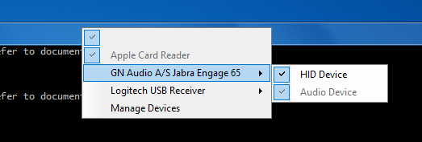

# Required Citrix configuration for VDI Windows

Using the kandy-hid SDK in a VDI Windows environment requires that HID devices be "split" and then the HID portion of the device be redrected to the Virtual Machine. Citrix documentation refers to this as "Composite USB device redirection". Citrix's documentation for the Citrix Workspace app for Windows describes the configuration steps.

What follows is a **reference**. For issues, questions, etc. please contact Citrix. 

## General
- If Citrix Policies are used, ensure that they do not block or disallow client USB device redirection
- Each Windows client PC must have the Citrix Workspace app for Windows installed (version 2012 used during verification)

## Disclaimer: 
- The following procedure has only be validated locally, not on a domain
- The procedure(s) required for a customer to achieve Composite USB device redirection may differ based on configuration, software versions, and other factors. Engage Citrix for assistance if required.
- The following is provided as a reference / example only, and describes the configuration used during verification

## Group Policies
Citrix recommends use of Windows Group Policies to apply configuration changes, either locally (i.e. affecting a single PC) or at a domain level.

**Group Policies can currently only be applied to Enterprise or Professional versions of Windows, not Home Editions. At this time, Citrix does not formally support the use of the Citrix Workspace app in Windows Home Edition. Citrix is tracking support for the Workspace app as well as a procedure to perform Composite USB device redirection in Windows Home Editions via RFE ID-011075.**

The following is based Citrix documentation at https://docs.citrix.com/en-us/citrix-workspace-app-for-windows/getting-started.html#group-policy-object-administrative-template

## Copy Files to System Folders
In order to make Citrix configuration changes via the Group Policy Editor, certain Citrix files must be copied to specific Windows system folders (either locally or, presumably, on a domain controller PC).

Note these commands are intended to be executed in a Windows Command Prompt (not Powershell) **as Administrator**.

C:\>cd "c:\Program Files (x86)\Citrix\ICA Client" 

C:\> copy Configuration\CitrixBase.admx %systemroot%\PolicyDefinitions\ 

C:\> copy Configuration\receiver.admx %systemroot%\PolicyDefinitions\ 

C:\> copy Configuration\en-US\CitrixBase.adml %systemroot%\PolicyDefinitions\en-US\ 	# for English; other languages are available

C:\> copy Configuration\en-US\receiver.adml %systemroot%\PolicyDefinitions\en-US\

## Enable Device Splitting in the Group Policy Editor
The following has the effect of splitting USB "composite" devices and allowing the HID portions of Jabra devices to be accessed in Windows.

Based on Citrix documentation at https://docs.citrix.com/en-us/citrix-workspace-app-for-windows/configure.html#composite-usb-device-redirection

- Run 'gpedit.msc' to open the Group Policy editor
- Under Computer Configuration → Administrative Templates → Citrix Components → Citrix Workspace → Remoting client devices, select Generic USB Remoting
- Set:
    - USB Device Rules = Enabled
        - In Options: "Allow: VID=0B0E Class=03 split=01 intf=03" (without the quotes)
    - Existing USB Devices = Enabled
        - Options: When desktop starts = Connect all available USB devices
    - New USB Devices = Enabled
        - Options: When a USB device is inserted = Connect the USB device
    - Redirect Unknown USB Devices = Enabled
    - Split Devices = Enabled

## Deny Audio Redirection in the Registry
The following has the effect of denying redirection of audio portions of Jabra devices to Windows Virtual Machine (VM).

- Run 'regedit.msc' to open the Registry editor
- Backup the entire registry (optional)
- Select HKLM\SOFTWARE\WOW6432Node\Citrix\ICA Client\Generic USB\   (for a 64-bit Windows PC)
- Under "DeviceRules", **add a new second-last line**. i.e. insert the following **immediately above** "ALLOW: #Otherwise allow everything else"
    - DENY: VID=0B0E Class=01

## Verify Device Splitting
Connect the Citrix Session. In the pulldown menu at the top of the VM screen, under Devices you should see any connected Jabra devices listed.

By default the Audio aspect of the device will be available to both the VM and the client. The HID aspect of the device will not be automatically redirected. Click "HID Device" in order to enable redirection for a session.

It should look like this once enabled:

**This "HID Device" redirection setting does not persist, therefore this step must be repeated every time you connect the session.**

Citrix is aware of this limitation and has an enhancement request (RFE ID-008308) tracking automatic redirection of the HID device planned to be included in a future release of the Workspace App. No forecast is available at this time.
